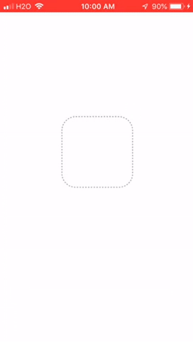

Example app for Mobile app class Spring 2019.

# Setup
```
expo init todoapp2 --template blank@sdk-32 --yarn
cd todoapp2
yarn add native-base --save
yarn add @expo/vector-icons --save
yarn start

```
# Step 1
Create a static list of todos. We will use the
[List component](http://docs.nativebase.io/Components.html#list-def-headref)
from native-base.

See this [diff](https://github.com/lubaochuan/todoapp2/commit/bc21e7e8166aa675087e6cada171b6cc2b2d91e2)
for the solution.

# Step 2
Render an array of todo items by following this
[example](https://github.com/GeekyAnts/NativeBase-KitchenSink/blob/master/src/screens/list/basic-list.js).

See this [diff](https://github.com/lubaochuan/todoapp2/commit/6fdeb37a1c9b1ed5195475374225dca6125a0863)
for the solution.

# Step 3
Add an input field for new todos by following this
[example](http://www.reactnativeexpress.com/data_component_state)

Play with the app, check the console output and try to identify some problems.
I shouldn't add the new todo item to the list yet.

See this [diff](https://github.com/lubaochuan/todoapp2/commit/7c22705de17b8b25d5ebd0015f316a6cc55a3e87?diff=split) for the solution.

[controlled input](https://learn.freecodecamp.org/front-end-libraries/react/create-a-controlled-input)

# Step 4
Handle adding new todo with a reverse data flow.

See this [diff](https://github.com/lubaochuan/todoapp2/commit/e89fbcb5cb1b4d3914797d887aa9a259a03e50ab) for the solution.

# Step 5
Delete a todo with a tap.

To use array index to identify items, we must understand the signature of
the [`renderRow` function](http://facebook.github.io/react-native/docs/listview.html#renderrow)

The `ListItem` in native-base implements react-native's [`touchablehighlight`](https://facebook.github.io/react-native/docs/touchablehighlight.html)
Therefore, a `ListItem` can respond to `press` events.

See this [diff](https://github.com/lubaochuan/todoapp2/commit/19455ed1bf539a1c196514c455061cad258cebee) for the solution.

You app should look as follows:



# Step 6
Add EditScreen and navigate to it. We will apply what we learned from
[this example add](https://github.com/lubaochuan/react-navigation).

First, install `react-navigation` package:
```
yarn add react-navigation --save
```

We will use a pop-up menu to let users select "edit", "delete", or cancel.
The menu is activated by long-press on a todo item.

# Step 7
Use redux to manage state and use firebase for remote storage.

Install packages:
```
yarn add redux react-redux --save
yarn add firebase redux-thunk --save
 ```
